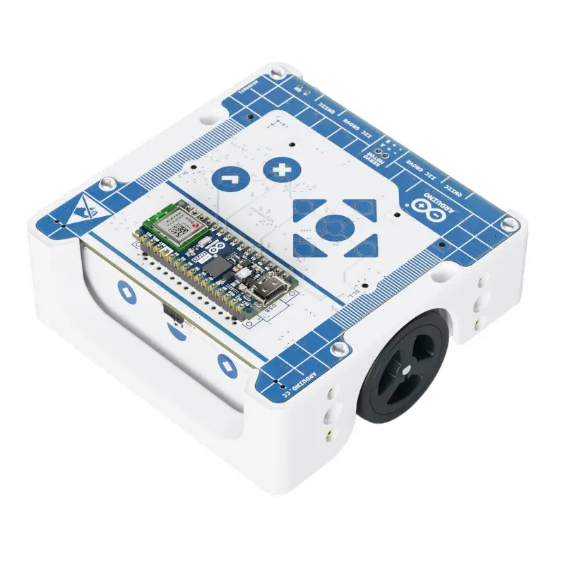

# CS-549 Robotics
## Weekend Intensive

**Instructor:** [Your Name]
**Date:** [Date]

---

# Welcome!

Over the next two days, you will:

- Learn path planning algorithms (A*, wavefront)
- Understand robot kinematics and odometry
- Program a real robot (Arduino Alvik)
- Work with sensors for autonomous navigation
- Build a maze-solving robot

<!-- 
NOTES:
- Introduce yourself
- Ask students to briefly introduce themselves (name, background, what they hope to learn)
- Set expectations: this is intensive, hands-on, and fun
-->

---

# Schedule Overview

## Day 1: Foundations
- Morning: Path planning algorithms
- Afternoon: Robot kinematics, motor control, first robot programs

## Day 2: Navigation
- Morning: Sensors and maze algorithms
- Afternoon: Integration, maze challenge competition

<!-- 
NOTES:
- Emphasize the hands-on nature
- Mention breaks are scheduled but we'll be flexible
- Labs build on each other - important to keep up
-->

---

# What is a Robot?

> "A robot is a machine capable of carrying out a complex series of actions automatically, especially one programmable by a computer."

Key characteristics:
- **Sense** - perceive the environment
- **Plan** - decide what to do
- **Act** - execute movements

<!-- 
NOTES:
- This is the classic "Sense-Plan-Act" paradigm
- Modern robotics often blurs these boundaries (reactive behaviors)
- Ask: "What robots have you interacted with?"
-->

---

# The Robotics Landscape


- **Industrial**: Manufacturing, warehouses
- **Service**: Cleaning, delivery, healthcare
- **Exploration**: Mars rovers, underwater
- **Personal**: Vacuums, lawn mowers
- **Research**: Humanoids, swarms

<!-- 
NOTES:
- Boston Dynamics Spot shown - discuss capabilities
- Amazon warehouses use thousands of robots
- Mars rovers are autonomous due to communication delay
- Ask students what applications interest them
-->

---

# Mobile Robot Types

| Type | Movement | Example |
|------|----------|---------|
| Wheeled | Differential drive, Ackermann | Alvik, cars |
| Legged | Walking, running | Spot, humanoids |
| Aerial | Rotors, wings | Drones, planes |
| Aquatic | Propellers, fins | AUVs, underwater gliders |
| Hybrid | Multiple modes | Amphibious robots |

<!-- 
NOTES:
- We'll focus on wheeled robots (differential drive)
- Differential drive = two independently controlled wheels
- Simpler than Ackermann (car-like) steering
-->

---

# Our Robot: Arduino Alvik

<!--  -->


- **Brain**: Arduino Nano ESP32
- **Motors**: 2x DC with encoders
- **Sensors**: ToF distance, line sensors, IMU
- **Size**: ~10cm x 10cm
- **Programming**: MicroPython

<!-- 
NOTES:
- Show the actual Alvik robot
- Point out the sensors, wheels, LEDs
- Mention it's designed for education
- We'll be programming it in MicroPython
-->

---

# The Fundamental Problem

## How does a robot get from A to B?

1. **Where am I?** (Localization)
2. **Where do I want to go?** (Goal)
3. **How do I get there?** (Planning)
4. **How do I avoid obstacles?** (Collision avoidance)
5. **How do I execute the plan?** (Control)

<!-- 
NOTES:
- These questions drive the entire field
- We'll touch on all of these this weekend
- Emphasis on planning and control
- Localization is hard - we'll use dead reckoning
-->

---

# Course Materials

## GitHub Repository
```
https://github.com/jchoate1/CS-549-Robotics
```

Contains:
- Lab starter code
- Alvik examples
- Documentation
- These slides

<!-- 
NOTES:
- Have students clone or download the repo now
- Walk through the structure briefly
- Make sure everyone can access it
-->

---

# Development Environment

## For Path Planning (Lab 1)
- Python 3.9+
- NumPy, Matplotlib

## For Robot Programming (Labs 2-5)
- **Thonny IDE** (recommended)
- Arduino Alvik connected via USB-C

<!-- 
NOTES:
- Check that everyone has Thonny installed
- If not, help them install during the first break
- Python labs can run on any machine
-->

---

# Lab Overview

| Lab | Topic | Platform |
|-----|-------|----------|
| Lab 1 | A* Path Planning | Python |
| Lab 2 | Drive Square, Dead Reckoning | Alvik |
| Lab 3 | Distance Sensors | Alvik |
| Lab 4 | Wall Following | Alvik |
| Lab 5 | Maze Challenge | Alvik |

<!-- 
NOTES:
- Lab 1 is pure software - algorithm implementation
- Labs 2-5 are on the physical robot
- Each lab builds on the previous
- Lab 5 is the capstone - navigate a maze autonomously
-->

---

# Assessment

This is a hands-on course. Assessment is based on:

1. **Lab completion** - demonstrate working code
2. **Final maze challenge** - timed competition
3. **Participation** - engage with the material

No written exams in this format.

<!-- 
NOTES:
- Emphasize learning over grades
- Everyone should be able to complete the labs
- The competition is for fun - no pressure
-->

---

# Questions?

Before we dive in:

- Any questions about logistics?
- Course structure?
- What we'll cover?

<!-- 
NOTES:
- Take 5 minutes for questions
- Address any concerns
- Make sure everyone is ready to proceed
-->

---

# Let's Begin!

## Next: Configuration Space

We'll learn how to represent the robot's environment in a way that makes path planning possible.

<!-- 
NOTES:
- Transition to the next module
- Take a short break if needed (5 min)
-->
